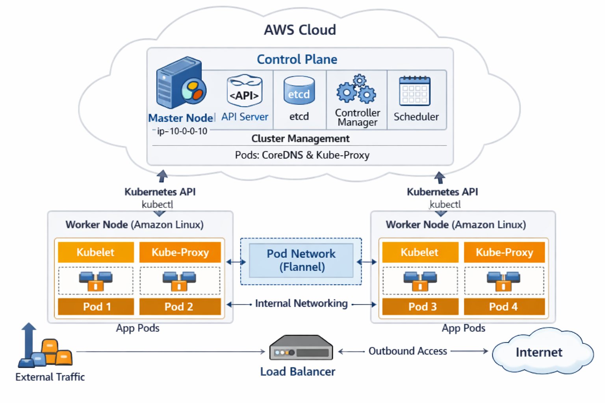

# Kubernetes Cluster Setup on AWS

**Hybrid cluster:** Ubuntu 22.04 master + Amazon Linux 2 workers, bootstrapped with `kubeadm`.

---

## Table of Contents

- [Architecture](#architecture)
- [Prerequisites](#prerequisites)
- [Provisioning with Terraform](#provisioning-with-terraform)
- [Cluster Setup Steps](#cluster-setup-steps)
- [Verification](#verification)
- [Problems & Fixes](#problems--fixes)
- [Quick Recovery Checklist](#quick-recovery-checklist)

---

## Architecture



| Node        | OS              | Instance   | Private IP  | Role          |
|-------------|-----------------|------------|-------------|---------------|
| Master      | Ubuntu 22.04    | t3.medium  | `10.0.0.10` | control-plane |
| Worker 1    | Amazon Linux 2  | t3.small   | `10.0.0.11` | worker        |
| Worker 2    | Amazon Linux 2  | t3.small   | `10.0.0.12` | worker        |

---

## Prerequisites

- AWS account with IAM user (EC2 + VPC permissions)
- SSH key pair created in AWS
- Security group with rules:

| Port Range     | Purpose               |
|----------------|-----------------------|
| 22             | SSH                   |
| 6443           | Kubernetes API server |
| 10250          | Kubelet API           |
| 10255          | Kubelet read-only     |
| 30000–32767    | NodePort services     |

---

## Provisioning with Terraform

```bash
cd terraform/
cp terraform.tfvars.example terraform.tfvars
# Edit terraform.tfvars with your key name and public key path
terraform init
terraform apply -auto-approve
```

---

## Cluster Setup Steps

### 1. Update Packages

```bash
# Master (Ubuntu)
sudo apt update && sudo apt upgrade -y

# Workers (Amazon Linux)
sudo yum update -y
```

### 2. Install Container Runtime (containerd)

```bash
# Master (Ubuntu)
sudo apt install -y containerd

# Workers (Amazon Linux)
sudo yum install -y containerd
```

**Configure containerd on all nodes:**

```bash
sudo mkdir -p /etc/containerd
containerd config default | sudo tee /etc/containerd/config.toml
```

Edit `/etc/containerd/config.toml` and set:

```toml
[plugins."io.containerd.grpc.v1.cri".containerd.runtimes.runc.options]
  SystemdCgroup = true
```

Restart and enable:

```bash
sudo systemctl restart containerd
sudo systemctl enable containerd
```

### 3. Install Kubernetes Components

**Master (Ubuntu):**

```bash
sudo mkdir -p /etc/apt/keyrings
curl -fsSL https://pkgs.k8s.io/core:/stable:/v1.29/deb/Release.key | \
  sudo gpg --dearmor -o /etc/apt/keyrings/kubernetes-apt-keyring.gpg

echo "deb [signed-by=/etc/apt/keyrings/kubernetes-apt-keyring.gpg] https://pkgs.k8s.io/core:/stable:/v1.29/deb/ /" | \
  sudo tee /etc/apt/sources.list.d/kubernetes.list

sudo apt update
sudo apt install -y kubelet kubeadm kubectl
sudo apt-mark hold kubelet kubeadm kubectl
```

**Workers (Amazon Linux):**

```bash
cat <<EOF | sudo tee /etc/yum.repos.d/kubernetes.repo
[kubernetes]
name=Kubernetes
baseurl=https://pkgs.k8s.io/core:/stable:/v1.29/rpm/
enabled=1
gpgcheck=1
gpgkey=https://pkgs.k8s.io/core:/stable:/v1.29/rpm/repodata/repomd.xml.key
EOF

sudo yum install -y kubelet kubeadm kubectl
```

**Enable kubelet on all nodes:**

```bash
sudo systemctl enable --now kubelet
```

### 4. Configure Kernel Parameters (All Nodes)

```bash
sudo modprobe br_netfilter
echo "br_netfilter" | sudo tee /etc/modules-load.d/br_netfilter.conf

cat <<EOF | sudo tee /etc/sysctl.d/k8s.conf
net.bridge.bridge-nf-call-iptables = 1
net.ipv4.ip_forward = 1
EOF

sudo sysctl --system
```

### 5. Disable Swap (All Nodes)

```bash
sudo swapoff -a
sudo sed -i '/ swap / s/^\(.*\)$/#\1/g' /etc/fstab
```

### 6. Initialize the Master Node

```bash
sudo kubeadm init --pod-network-cidr=10.244.0.0/16
```

**Configure kubectl:**

```bash
mkdir -p $HOME/.kube
sudo cp -i /etc/kubernetes/admin.conf $HOME/.kube/config
sudo chown $(id -u):$(id -g) $HOME/.kube/config
```

**Save the join command** printed at the end of `kubeadm init` — you will need it for the workers.

### 7. Install CNI Plugin (Flannel)

```bash
kubectl apply -f https://raw.githubusercontent.com/flannel-io/flannel/master/Documentation/kube-flannel.yml
```

### 8. Join Worker Nodes

On each worker, run the join command with `sudo`:

```bash
sudo kubeadm join 10.0.0.10:6443 --token <TOKEN> \
    --discovery-token-ca-cert-hash sha256:<HASH>
```

### 9. Amazon Linux DNS Workaround

Amazon Linux 2 does not have `/run/systemd/resolve/resolv.conf`. Create it so kube-proxy pods can start:

```bash
sudo mkdir -p /run/systemd/resolve
sudo ln -s /etc/resolv.conf /run/systemd/resolve/resolv.conf
sudo systemctl restart kubelet
```

---

## Verification

```bash
kubectl get nodes
kubectl get pods -n kube-system
```

**Expected output:**

```
NAME                        STATUS   ROLES           AGE   VERSION
ip-10-0-0-10                Ready    control-plane   18m   v1.29.15
ip-10-0-0-11.ec2.internal   Ready    <none>          14m   v1.29.15
ip-10-0-0-12.ec2.internal   Ready    <none>          13m   v1.29.15

NAME                                   READY   STATUS    RESTARTS   AGE
coredns-*                              1/1     Running   0          18m
etcd-ip-10-0-0-10                      1/1     Running   0          18m
kube-apiserver-ip-10-0-0-10            1/1     Running   0          18m
kube-controller-manager-ip-10-0-0-10   1/1     Running   0          18m
kube-proxy-*                           1/1     Running   0          18m
kube-scheduler-ip-10-0-0-10            1/1     Running   0          18m
```

---

## Problems & Fixes

### Problem 1: 404 Not Found — Old Kubernetes Repos

**Symptom:** `apt-get update` or `yum install` fails with `404 Not Found` for `apt.kubernetes.io` or `packages.cloud.google.com/yum/repos/kubernetes-el7-x86_64`.

**Cause:** The legacy Google-hosted repos (`apt.kubernetes.io`, `packages.cloud.google.com`) have been deprecated and removed.

**Fix:** Use the new official repo `pkgs.k8s.io`. Remove the old repo file, add the new one, and re-run the install.

```bash
# Ubuntu — remove old broken repo
sudo rm -f /etc/apt/sources.list.d/kubernetes.list

# Add new pkgs.k8s.io repo (see Step 3 above)
```

---

### Problem 2: Preflight Errors (bridge-nf-call-iptables / ip_forward)

**Symptom:**

```
[ERROR FileContent--proc-sys-net-bridge-bridge-nf-call-iptables]: does not exist
[ERROR FileContent--proc-sys-net-ipv4-ip_forward]: contents are not set to 1
```

**Cause:** Required kernel networking parameters are not configured. `br_netfilter` module is not loaded, and `ip_forward` is disabled.

**Fix:** Load `br_netfilter` and apply sysctl settings on all nodes (see Step 4).

---

### Problem 3: IsPrivilegedUser Error

**Symptom:**

```
[ERROR IsPrivilegedUser]: user is not running as root
```

**Cause:** `kubeadm` must run as root to modify system files and networking.

**Fix:** Always prefix `kubeadm` commands with `sudo`.

```bash
sudo kubeadm init ...
sudo kubeadm join ...
sudo kubeadm reset ...
```

---

### Problem 4: context deadline exceeded / TLS Bootstrap Failure

**Symptom:**

```
error execution phase kubelet-start: context deadline exceeded
```

**Cause:** Cgroup driver mismatch — kubelet expects `systemd` but containerd is using `cgroupfs`.

**Fix:** Set `SystemdCgroup = true` in `/etc/containerd/config.toml`, then restart both services:

```bash
sudo systemctl restart containerd
sudo systemctl restart kubelet
```

---

### Problem 5: Workers Stuck NotReady — kube-proxy ContainerCreating

**Symptom:**

```
kubectl get nodes
# workers show NotReady

kubectl get pods -n kube-system
# kube-proxy on workers stuck in ContainerCreating

kubectl describe pod kube-proxy-<id> -n kube-system
# Failed to create pod sandbox: open /run/systemd/resolve/resolv.conf: no such file or directory
```

**Cause:** Amazon Linux does not have `/run/systemd/resolve/resolv.conf` (it is a systemd-resolved file present on Ubuntu). Kubelet's default pod sandbox configuration expects this file to exist.

**Fix:** Create the directory and symlink to the system's `resolv.conf`:

```bash
sudo mkdir -p /run/systemd/resolve
sudo ln -s /etc/resolv.conf /run/systemd/resolve/resolv.conf
sudo systemctl restart kubelet
```

---

### Problem 6: Leftover Configs Blocking Re-join

**Symptom:**

```
[ERROR FileAvailable--etc-kubernetes-kubelet.conf]: /etc/kubernetes/kubelet.conf already exists
[ERROR Port-10250]: Port 10250 is in use
[ERROR FileAvailable--etc-kubernetes-pki-ca.crt]: /etc/kubernetes/pki/ca.crt already exists
```

**Cause:** A previous failed join attempt left stale configuration files and a running kubelet on the worker.

**Fix:** Clean the node completely before retrying:

```bash
sudo kubeadm reset -f
sudo rm -rf /etc/kubernetes/*
sudo systemctl restart containerd kubelet
# Then re-run the join command
```

---

### Problem 7: Version Mismatch Between Master and Workers

**Symptom:** Master runs v1.29.15, workers show v1.30.14 after joining.

**Cause:** The join command was generated from a later `kubeadm init` attempt that picked a newer patch version, or the worker nodes were installed with a different version.

**Fix:** Pin the same version across all nodes during installation:

```bash
# Ubuntu
sudo apt install -y kubelet=1.29.15-* kubeadm=1.29.15-* kubectl=1.29.15-*
sudo apt-mark hold kubelet kubeadm kubectl

# Amazon Linux
sudo yum install -y kubelet-1.29.15 kubeadm-1.29.15 kubectl-1.29.15
```

---

## Quick Recovery Checklist

Use this to reset and rejoin a worker node from scratch:

```bash
sudo kubeadm reset -f
sudo rm -rf /etc/kubernetes/*
sudo systemctl restart containerd
sudo systemctl restart kubelet
sudo kubeadm join <MASTER_IP>:6443 --token <TOKEN> \
    --discovery-token-ca-cert-hash sha256:<HASH>
```

Ensure these settings are in place before joining:

| Check                          | Command                                                      |
|--------------------------------|--------------------------------------------------------------|
| `br_netfilter` loaded         | `lsmod \| grep br_netfilter`                                  |
| `ip_forward` enabled          | `sysctl net.ipv4.ip_forward` → should be `1`                 |
| `bridge-nf-call-iptables` set | `sysctl net.bridge.bridge-nf-call-iptables` → should be `1`  |
| `SystemdCgroup = true`        | `grep SystemdCgroup /etc/containerd/config.toml`             |
| DNS symlink exists            | `ls -la /run/systemd/resolve/resolv.conf`                    |


---

## Automation

A bash script automating the full setup is available at [`scripts/setup-k8s.sh`](scripts/setup-k8s.sh).

```bash
# On the master:
sudo ./scripts/setup-k8s.sh master

# On each worker (replace <JOIN_CMD> with the output from the master):
sudo ./scripts/setup-k8s.sh worker "<JOIN_CMD>"
```
